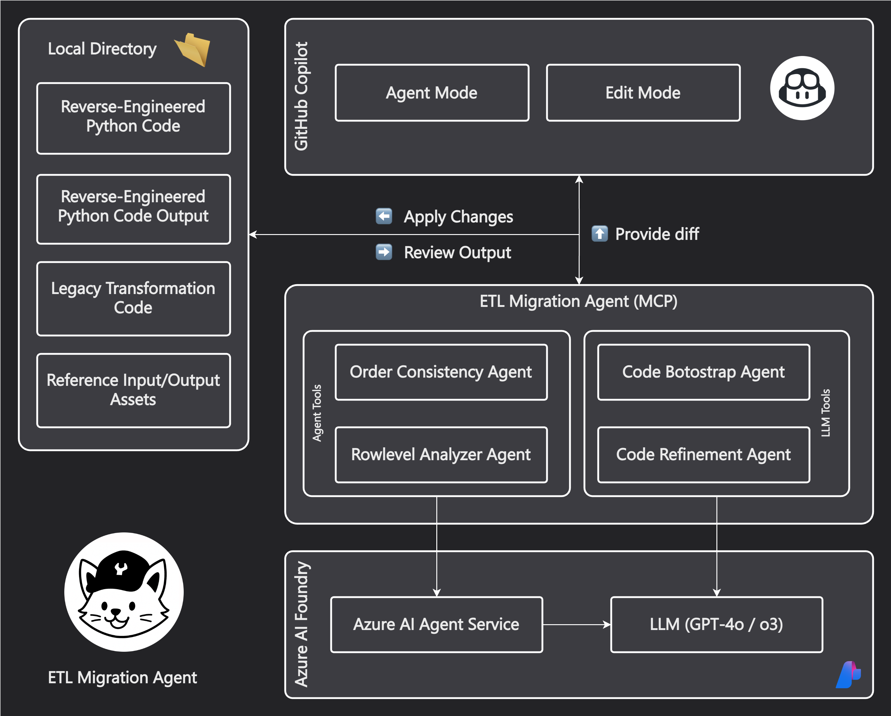
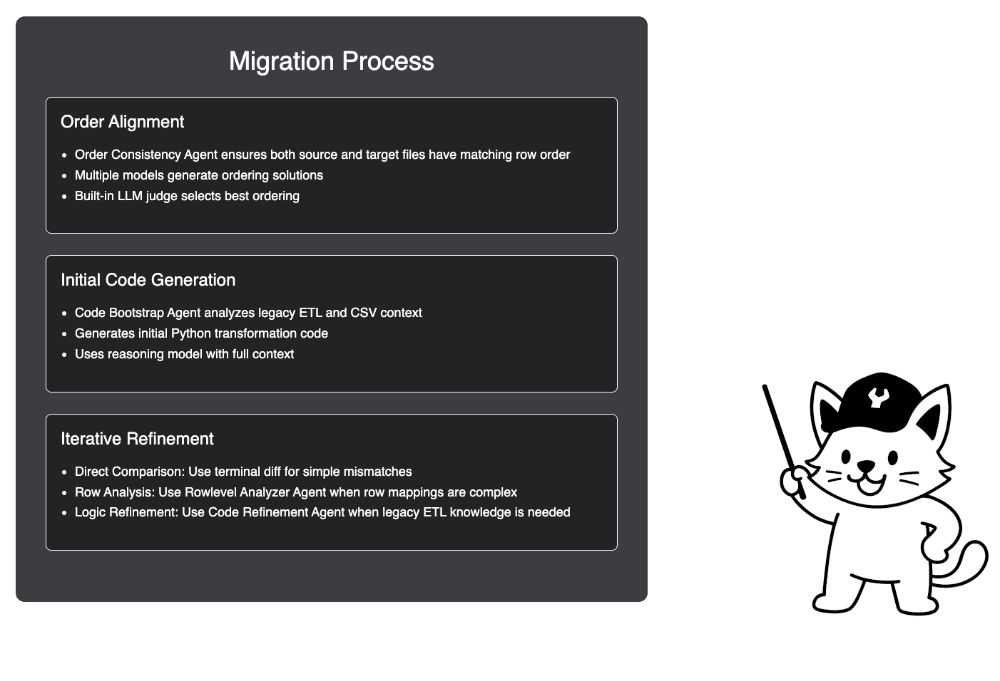

<div align="center">

<h1>ETL Migration Agent</h1>
<p>GitHub Copilot for Migrating Legacy ETL Scripts 🤯</p>

[]()
[]()
[]()
</div>

## Overview
ETL Migration Agent is a Model Context Protocol (MCP) server that extends GitHub Copilot with specialized tools for migrating legacy ETL code to Python. It provides a suite of AI-powered tools that work together to analyze, convert, and validate ETL transformations.

**Sample Output**: See [`test_data/transformation_script.py`](test_data/transformation_script.py) for an example of generated Python code that migrates legacy SQL ETL logic to pandas operations.

## Architecture

<div align="center">

</div>

### Core Services
- **Azure AI Foundry**: Provides access to LLMs (o3, gpt-4.1, gpt-4o) for language understanding and code generation
- **Azure AI Agent Service**: Used to build agents that perform changes or analysis on files
- **MCP Server**: Enables integration with GitHub Copilot by exposing tools through the Model Context Protocol

### Tool and Agent Overview

| Tool/Agent | Purpose | Implementation | Models Used |
|------------|---------|----------------|-------------|
| Order Consistency Agent | Ensures source and target files have matching row orders + Uses LLM judge to select best ordering from multiple models | Azure AI Agent Service + Code Interpreter + LLM Judge | `gpt-4`, `gpt-4.1` |
| Code Bootstrap Agent | Initial Python code generation from legacy ETL | Azure AI Foundry | Configured deployment model |
| Rowlevel Analyzer Agent | Comparison of output differences + Uses LLM judge to identify matching rows across files | Azure AI Agent Service + Code Interpreter + LLM Judge | Multiple model parallel processing |
| Code Refinement Agent | Refine Python code based on legacy ETL knowledge and current output. | Azure AI Foundry | `gpt-4.1` (configurable) |

<div align="center">
</div>

#### Migration Process
1. **Order Alignment** 
   - Order Consistency Agent ensures both source and target files have matching row order
   - Multiple models generate ordering solutions
   - Built-in LLM judge selects best ordering

2. **Initial Code Generation**
   - Code Bootstrap Agent analyzes legacy ETL and CSV context
   - Generates initial Python transformation code
   - Uses reasoning model with full context

3. **Iterative Refinement**
   Choose the appropriate method based on issues:
   - **Direct Comparison**: Use terminal diff for simple mismatches
   - **Row Analysis**: Use Rowlevel Analyzer Agent when row mappings are complex
   - **Logic Refinement**: Use Code Refinement Agent when legacy ETL knowledge is needed

## Configuration Options
| Environment Variable | Description | Default |
|---------------------|-------------|----------|
| `AZURE_OPENAI_API_KEY` | Azure OpenAI API key | Required |
| `AZURE_OPENAI_ENDPOINT` | Azure OpenAI endpoint URL | Required |
| `AZURE_OPENAI_DEPLOYMENT_NAME` | OpenAI model deployment name | `o3` |
| `AZURE_OPENAI_API_VERSION` | API version | `2024-12-01-preview` |
| `MODEL_DEPLOYMENTS` | Comma-separated list of models | `gpt-4,gpt-4o-dz,gpt-4.1,gpt-4o` |
| `REFINEMENT_MODEL` | Model for code refinement | `gpt-4.1` |
| `BEST_OUTPUT_SELECTOR_MODEL` | Model for selecting best output | `gpt-4.1` |
| `LEGACY_ETL_CODE_DESCRIPTION` | Type of legacy code | e.g. `SQL` |
| `PROJECT_ENDPOINT` | Azure AI Agents project endpoint | Required |
| `LOG_LEVEL` | Logging level | `INFO` |

## Prompts / Sample Migration Steps
Ready to get your paws dirty with ETL migration? Follow these step-by-step prompts to transform your legacy code into modern Python! Each step builds on the previous one, so work through them in order for the best results.


### 1. File Order Alignment
```markdown
call #order_consistency_agent
Legacy ETL Output file: /workspaces/etl-migration-agent/test_data/output.csv
Source File: /workspaces/etl-migration-agent/test_data/input.csv
Data directory: /workspaces/etl-migration-agent/test_data
```

Review the generated files in the `/workspaces/etl-migration-agent/test_data` directory. The agent will create a new file with the same name as the original output file, but with `_ordered` appended to it (e.g., `output_ordered.csv`).
You may need to rerun the agent multiple times to ensure the row order matches between the source and target files. The agent will use multiple models to generate different row orders, and a built-in LLM judge will select the best one.

### 2. Initial Code Generation
```markdown
call #code_bootstrap_agent
Target directory: /workspaces/etl-migration-agent/test_data
Output file: transformation_script.py
```

This may take a few minutes as the agent analyzes the legacy ETL code and generates the initial Python transformation script. The generated script will be saved as `transformation_script.py` in the specified directory. We'll use the strongest reasoning model available to ensure the code is as accurate as possible.

### 3. Code Refinement Options

Choose the appropriate refinement method based on the issue:

A. **Row Mapping Issues**
```markdown
call #rowlevel_analyzer_agent
Working directory: /workspaces/etl-migration-agent/test_data
Files: output_PY.csv, output.csv
```

B. **Missing Legacy Functionality**
```markdown
call #code_refinement_agent
Working directory: /workspaces/etl-migration-agent/test_data
Files: transformation_script.py, input.csv, output.csv, output_PY.csv
```

C.. **CLI-based Validation**
Use diff (or other CLI tools) to compare outputs:
```bash
diff <(head -n 5 output_PY.csv) <(head -n 5 output.csv)
```

---

## Prompt 3a: Analyzing Row-Level Differences (GitHub Copilot - Edit Mode)

```markdown
Evaluate the current Python code and its output.  
Compare it to the expected output.

For files with different row mappings or sorting, use:  

call #rowlevel_analyzer_agent  

(Python output: output_PY.csv, Original output: output.csv)  

Files are located in: /workspaces/etl-migration-agent/test_data
```

---

## Prompt 3b: Refining Missing Functionality (GitHub Copilot - Edit Mode)

```markdown
Evaluate the current Python code and its output.  
Compare it to the expected output.

For missing functionality that requires knowledge of the legacy ETL code, use:  

call #code_refinement_agent  

(Python output: output_PY.csv, Original output: output.csv, input file: input.csv, transformation_script.py is not complete)  

Files are located in: /workspaces/etl-migration-agent/test_data

Goal: Fix transformation_script.py so that output_PY.csv matches output.csv.
```

---

## Prompt 3c: Applying Final Fixes (GitHub Copilot - Edit Mode)

Before running this prompt:
Compare outputs using this command:

```bash
diff <(head -n 5 output_PY.csv) <(head -n 5 output.csv)
```

Then run this prompt:

```markdown
call #terminalLastCommand

Apply necessary fixes in transformation_script.py to resolve any differences.
```

You can use this command to check the similarity percentage between the two CSV files:

```bash
python3 -c "import csv; a = list(csv.reader(open('output.csv'))); b = list(csv.reader(open('output_PY.csv'))); total = min(len(a), len(b)) * min(len(a[0]), len(b[0])); same = sum(1 for i in range(min(len(a), len(b))) for j in range(min(len(a[i]), len(b[i]))) if a[i][j] == b[i][j]); print(f'{same/total*100:.2f} % similar')"
```

You may need to diff more lines as you get closer to the final output.

# Setup
## Prerequisites
- Python 3.8+
- Azure OpenAI API credentials
- Azure AI Agents Project endpoint

## Quick Start
1. Create and activate a virtual environment:
```bash
python -m venv .venv
source .venv/bin/activate  # On Windows: .venv\Scripts\activate
```

2. Install dependencies:
```bash
pip install -r requirements.txt
```

3. Run the server with environment variables:
```bash
export AZURE_OPENAI_API_KEY="your_api_key_here"
export AZURE_OPENAI_ENDPOINT="your_endpoint_here"
export PROJECT_ENDPOINT="your_project_endpoint"
export LOG_LEVEL="INFO"
python server.py
```

## VS Code MCP Integration
Add this configuration to your VS Code settings (mcp.json):

```json
{
    "inputs": [
        {
            "type": "promptString",
            "id": "azure_openai_api_key",
            "description": "Azure OpenAI API Key",
            "password": true
        },
        {
            "type": "promptString",
            "id": "azure_openai_endpoint",
            "description": "Azure OpenAI Endpoint URL"
        },
        {
            "type": "promptString",
            "id": "azure_openai_deployment_name",
            "description": "Azure OpenAI Deployment Name (e.g., gpt-4, o3-mini)"
        },
        {
            "type": "promptString",
            "id": "azure_openai_api_version",
            "description": "Azure OpenAI API Version"
        },
        {
            "type": "promptString",
            "id": "project_endpoint",
            "description": "Azure AI Agents Project Endpoint URL"
        },
        {
            "type": "promptString",
            "id": "data_folder_path",
            "description": "Path to folder containing legacy code and CSV files"
        },
        {
            "type": "promptString",
            "id": "log_level",
            "description": "Logging level (DEBUG, INFO, WARNING, ERROR, CRITICAL)"
        }
    ],
    "servers": {
        "etl-migration": {
            "command": "python",
            "args": [
                "${workspaceFolder}/server.py"
            ],
            "env": {
                "PYTHONUNBUFFERED": "1",
                "AZURE_OPENAI_API_KEY": "${input:azure_openai_api_key}",
                "AZURE_OPENAI_ENDPOINT": "${input:azure_openai_endpoint}",
                "AZURE_OPENAI_DEPLOYMENT_NAME": "${input:azure_openai_deployment_name}",
                "LEGACY_ETL_CODE_DESCRIPTION": "SQL",
                "AZURE_OPENAI_API_VERSION": "${input:azure_openai_api_version}",
                "PROJECT_ENDPOINT": "${input:project_endpoint}",
                "LOG_LEVEL": "${input:log_level}"
            },
            "workingDirectory": "${workspaceFolder}/mcp"
        }
    }
}
```

## License
This project is licensed under the MIT License - see the [LICENSE](LICENSE) file for details.
